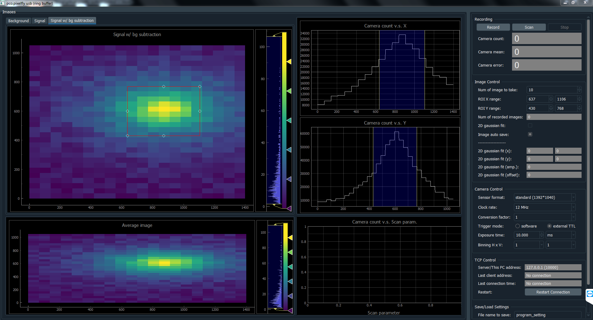

# pixelfly-python-control

This is a graphical user interface designed for [pco.pixelfly usb](https://www.pco.de/scientific-cameras/pcopixelfly-usb/) scientific cameras, for the purpose of applications in atomic, molecular and optical (AMO) physics experiments.

Written in Python 3.8.6, it's frequently tested on Win 7. A 24-inch 1080p monitor is recommended for the best graphical display.

## Usage

#### Control frame (right-hand side)
- Recording part
	- This part allows users to start or stop a camera recording task at any time. There are two modes of image acquiring, _Record_ and _Scan_. Different plots and indicators are updated in different modes. Current version of the program assumes that background images and signal images are taken alternatively, i.e. a background image is always followed by a signal image.
	- In _Record_ mode, the program and the camera take as many images as users determine in the Image control part. This is the "plain" mode and averages over all the acquired images.
	- In _Scan_ mode, the program reads the latest scan sequence file (.ini) and take images as this file indicates. This file is supposed to save a scan sequence as well as scan settings. This mode is used in conjunction with other devices to examine target system's (e.g. atoms or molecules) response to the scan parameters.
	- Camera count in region of interest in the current background subtracted image is updated in real time in both modes.

#### Image frame (left-hand side)

## Workflow in a nutshell
